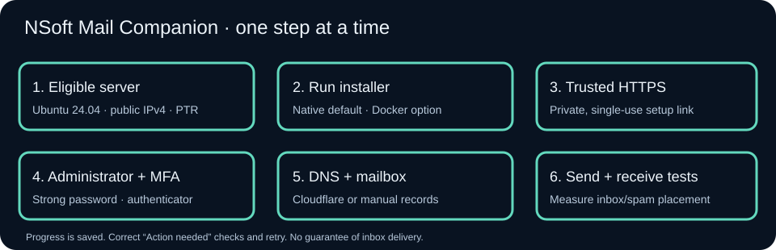

# Start with one command, finish in your browser

This guide covers the guided installer for **Ubuntu 24.04 LTS, Linux x86-64, one mail node**. Native Linux services are the default. Docker is an alternative selected in the installer. A VPS, dedicated server, or eligible home server uses the same browser wizard.

The installer is delivered in the implementation branch/PR. There is **no published installer release yet**. Use a reviewed, pinned commit when testing; do not point an unattended production installer at a moving branch. Fresh systemd installations, public certificate issuance and nontechnical-user trials remain release acceptance checks; see [verification](verification.md).



## 1. Prepare an eligible server

Choose Ubuntu 24.04 x86-64, reserve **8 GiB RAM** for mail plus capacity for Coolify applications, and leave at least 20 GiB free before allocating mailbox storage. Keep SSH access and a recovery console. Install available Ubuntu security updates first. The installer checks the OS, architecture, memory, disk, public IPv4, occupied mail ports, service identities, existing services and proxy. It refuses to replace an existing mail stack or database.

You need a domain you control, a certificate contact email, a stable public IPv4, and control of reverse DNS (PTR) at the server/IP provider. Example: `panel.example.com` is the administration panel and `mail.example.com` is the canonical SMTP/IMAP hostname. When your panel does not start with `panel.`, the installer prefixes its whole hostname with `mail.`; the displayed DNS preview shows the resulting name. Customer webmail uses `webmail.customer.example`.

Permit inbound TCP **25, 465, 587, 993, 80 and 443** in the provider firewall and any local firewall. Restrict SSH to your administration networks. Keep PostgreSQL 5432, Valkey 6379, Rspamd 11332–11334, ClamAV 3310, application API 4000, internal web 3000/8080 and challenge 8090 private. Alongside Coolify, its proxy connects to the two web backends through its private Docker bridge. Never expose those backends publicly. Docker-published ports need provider or Docker-aware firewall rules; UFW alone may not protect them.

**Hetzner:** verify SMTP restrictions in your account and request eligibility/unblocking where available before planning direct delivery. An outbound relay can work around outbound restrictions, but cannot open inbound SMTP. Configure the mail IP's PTR in Hetzner to the canonical hostname. [Hetzner Cloud FAQs](https://docs.hetzner.com/cloud/general/faq/).

**Home servers:** ask your ISP about CGNAT, static IPv4, inbound/outbound port 25, reverse DNS and hosting policy. With CGNAT you cannot simply forward inbound SMTP from the internet. A dynamic/residential IP, unavailable PTR, or blocked inbound 25 needs an eligible mail VPS even if the control panel runs at home. A public IP lookup alone cannot prove the absence of CGNAT: external receiving tests and PTR checks are mandatory. An outbound relay does not solve inbound connectivity. Read the [home-server guide](server-setup.md#13-home-hosting-when-to-use-a-vps-instead).

## 2. Run the installer

Open the server's SSH terminal. Install `git`, `python3` and `sudo` using your server provider's Ubuntu preparation instructions if they are absent. Clone the **reviewed commit** into a clean source directory outside `/opt/nsoft-mail-companion`; the installer owns that destination. For this implementation, the pinned installer commit is `c4497e31a39b77213c6dea72f326b58432b09932`. It becomes available from GitHub when the implementation PR branch is pushed. Prepare the checkout once:

```bash
sudo git clone --no-checkout https://github.com/NSoft-Academy/NSoft-Mail-Companion.git /usr/local/src/nsoft-mail-companion
sudo git -C /usr/local/src/nsoft-mail-companion checkout --detach c4497e31a39b77213c6dea72f326b58432b09932
cd /usr/local/src/nsoft-mail-companion
```

If that source directory already exists, preserve it and choose a different empty directory. Never replace an existing checkout or server installation. For a future reviewed release, use its documented commit instead. Run this one installer command from the checkout:

```bash
sudo ./scripts/install.sh
```

For preflight only, without installing packages:

```bash
sudo ./scripts/install.sh --check
```

Choose:

| Prompt              | What to enter                                        |
| ------------------- | ---------------------------------------------------- |
| Installation method | Press Enter for `native`, or enter `docker`          |
| Panel hostname      | For example `panel.example.com`                      |
| Certificate contact | An address you can currently receive mail at         |
| Certificate method  | `cloudflare` DNS challenge, or `http` for manual DNS |

For Cloudflare, create a **scoped API token** with Zone Read and DNS Edit for the required zone(s), and enter it at the hidden prompt. Never use your global API key. The installer previews missing panel/mail A records and requires approval before creating them. Conflicting records are preserved and installation pauses. Initially keep panel and mail A records DNS-only; SMTP/IMAP hostnames must always stay DNS-only. [Cloudflare email guidance](https://developers.cloudflare.com/dns/troubleshooting/email-issues/).

For manual DNS, create the displayed DNS-only A records for the panel and canonical mail hostname, pointing to the public IPv4. HTTP validation requires inbound port 80. The installer gives exact records and pauses until they resolve correctly.

The installer generates independent secrets, builds the application without root privileges, configures private database roles and dedicated service identities, then establishes trusted panel HTTPS before printing the private browser link. It never prints a link for an untrusted or unreachable HTTPS panel. Cloudflare Origin CA certificates are unsuitable for direct mail-client trust; use publicly trusted certificates. [Cloudflare certificate guidance](https://developers.cloudflare.com/ssl/origin-configuration/origin-ca/troubleshooting/).

## 3. Open the private setup link

The link expires after **30 minutes** and can create an administrator **once**. Open it privately; do not paste it into support tickets. Its token is removed from the browser address bar and is stored hashed on the server.

1. Create your administrator using a strong password. The address may be an existing outside email address.
2. Add the displayed secret to an authenticator app and confirm its six-digit code. Keep the enrollment secret private. MFA is required before any server administration.
3. Review server checks. “Action needed” explains what to correct. A connection test from the server is not proof of internet inbound connectivity.
4. Connect Cloudflare in the browser and select an accessible zone, or choose manual DNS. Provider credentials are encrypted in the database; certificate credentials also remain in root-only host storage.
5. Add your first domain. The ownership TXT record proves control. Publish the displayed MX, SPF, DKIM and DMARC records. Cloudflare previews selectable new records; it preserves existing records. Moving an existing domain's mail requires an explicit migration plan and deliberate DNS changes, not an automatic replacement.
6. Run DNS checks after propagation. Create your first mailbox, choose its password and quota, and provision the webmail certificate. Set webmail's A record to the server, DNS-only. The root service accepts certificate actions only for the canonical hostname or verified domain webmail hostnames.
7. Enable sending only after all readiness checks pass. Open webmail, send between local mailboxes, send to an outside account, and reply from that account. Confirm receiving as well as sending, inspect SPF/DKIM/DMARC and inbox/spam placement, then complete setup. **SMTP acceptance never guarantees inbox delivery.**

Progress is saved. After a reboot or interruption, sign in at `https://panel.example.com/setup`. Existing installations and mail are preserved. Bootstrap access stays closed after administrator creation.

## 4. If a step needs attention

Correct the message shown, then click **Retry** for a failed browser task. For an interrupted terminal installation:

```bash
sudo ./scripts/install.sh --resume
```

Resume uses the original method, commit and generated secrets. It does not convert native to Docker. If the first-run link expired before creating an administrator, resume prints a replacement after checking HTTPS again. Once an administrator exists, resume directs you to sign in.

| Message or symptom                  | Action                                                                                                                                                                                                               |
| ----------------------------------- | -------------------------------------------------------------------------------------------------------------------------------------------------------------------------------------------------------------------- |
| Existing services or occupied ports | Preserve them. Use another server or a separately planned migration. Do not uninstall them to force this installer through.                                                                                          |
| Cloudflare permission failure       | Grant Zone Read and DNS Edit only for the intended zone, then retry.                                                                                                                                                 |
| Conflicting DNS record              | Review the current mail/proxy routing and complete a deliberate migration before changing it.                                                                                                                        |
| Certificate issuance failure        | Check hostname DNS, token permissions, port 80 for HTTP challenges, and public 443; then resume.                                                                                                                     |
| PTR failure                         | Set reverse DNS at the IP provider; DNS-zone edits cannot set it.                                                                                                                                                    |
| Outbound 25 blocked                 | Request provider access or use the [documented optional relay](server-setup.md#6-select-mail-protocol-certificates-and-optional-relay). Relay configuration currently requires a controlled host maintenance change. |
| Receiving test fails at home        | Check router forwarding, ISP restrictions and CGNAT. Move the mail node to an eligible VPS when inbound connectivity is unavailable.                                                                                 |
| Mail waiting for certificate        | Fix public certificate issuance; the server intentionally keeps mail listeners closed until valid certificate files exist.                                                                                           |

The dashboard offers a **downloadable redacted diagnostic report** containing task states and revision information. It excludes passwords, provider tokens, setup tokens, keys, environment files and raw logs. Send that report when reporting a problem; never attach `/etc/nsoft-mail`, database dumps or mail storage.

## 5. Keep your server healthy

Open **Server setup & health** from the platform dashboard. Review certificates, server checks, task failures, backups and installed update revision. A systemd timer runs health checks and renews issued certificates before expiry. Public ACME rate limits, DNS permissions and connectivity can still cause renewal failures; “Action needed” must be resolved before expiration.

Configure an HTTPS S3-compatible off-server backup repository in the browser. Use a unique encryption password and save it in offline recovery storage. To prevent a compromised administration application from silently redirecting all mail and keys to another destination, the root service only stages a proposal. Confirm the **exact destination** in the server terminal:

```bash
sudo /opt/nsoft-mail-companion/scripts/install.sh --approve-backup
```

This is a confirmation prompt, not configuration-file editing. It enables daily encrypted backups with randomized scheduling. Backups briefly pause mail writers. They include PostgreSQL dumps, messages, queues, keys and installation state. Run **Backup now**, then **Check restore**. The guided check restores an archive into a separate private directory and checks dump presence; it does **not** declare a live database/mail recovery drill complete. Follow [recovery procedures](operations.md), rehearse database import and SMTP/IMAP/webmail on an isolated server, and retain verified recovery material.

There are no automatic updates or deployment-method conversions. Record the installed commit, take and verify a backup, review the next revision, and follow the [maintenance procedure](guided-maintenance.md). Keep Ubuntu security updates current. Capacity is limited by measured server resources and abuse controls, not paid account caps.

Copyright © 2026 M Suthakaran, trading as NSoft Academy. Licensed under the Apache License, Version 2.0.
